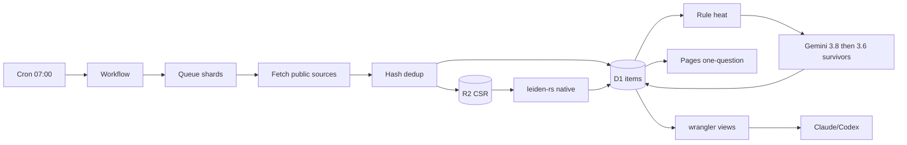

# Brainstorm: Radar Content hàng nhà trồng (Graph + Leiden)

## Summary

Greenfield repo. Five `docs/` screenshots of a live Radar (Jobs/News/Hands-on/Deep dives). Target is a **homegrown** daily pipeline on **Cloudflare Paid** that answers one question from public sources: AI/Agent research+apps — what is interesting, which way is it shifting.

Core is **coded graph + Leiden**, not LLM clustering. Gemini free (`gemini-3.8-flash` → `gemini-3.6-flash`) extracts insight/evidence/counter on survivors only. Claude/Codex query D1 via wrangler for anomaly/assumption/trending — offline, small quota.

**Ship B:** sharded CF crawl → D1 items + R2 CSR → native `leiden-rs` writeback → Pages digest. Reject A (WASM Leiden in 128 MB isolate) until measured. Reject C (JS Louvain) — violates Leiden contract.

## Outcome

Daily batch on Cloudflare Workers **Paid**:

1. Crawl allowlisted public AI/Agent sources (bots/RSS/APIs). Dedup.
2. Rule-filter to items of interest. No LLM.
3. Persist documents/entities/edges in D1. CSR snapshot on R2.
4. Run **Leiden** (`leiden-rs` 0.8.1). Write `community_id`.
5. Score heat without LLM. Gemini 3.8→3.6 extracts insight / 3 evidence bullets / counter **only on heat survivors**.
6. Pages answers: *Giới nghiên cứu và ứng dụng AI/Agent đang có gì thú vị, và đang dịch chuyển về hướng nào?*
7. `wrangler d1` views for Claude/Codex: anomaly, assumption, trending.

Scale to match screenshots as **ingest envelope**, not UI clone: ~767 accounts, ~6k posts/day, ~200–300 articles, ~23–28 min wall, daily ~07:00.

## Constraints

| Constraint | Evidence |
|---|---|
| Workers **Paid required** | Free = 10 ms CPU. Screenshot crawl 23–28 min. Free Workflows 10 ms/step. Unusable. [CF limits 2026-09-05](https://developers.cloudflare.com/workers/platform/limits/) |
| Isolate 128 MB incl. WASM | Hard ceiling. Bundle 64 MiB. |
| Queue/Cron wall 15 min | Screenshot crawl 23–28 min → **must shard**. Workflow Paid cron firing: 1h concurrency budget = crawl envelope. [Workflows limits 2026-06-15](https://developers.cloudflare.com/workflows/reference/limits/) |
| D1 single-thread | 10 GB paid, 2 MB row, 100 KB SQL, 100 bind params, 30s query, 6 conns, 1000 queries/invocation. Not a graph engine. [D1 limits 2026-04-21](https://developers.cloudflare.com/d1/platform/limits/) |
| Workflow step result 1 MiB | CSR cannot pass between steps. Pointers to R2 only. |
| LLM $0 | Free Gemini only. Limits **per project not per key**. RPM/TPM/RPD. RPD midnight PT. Exact RPD unpublished (AI Studio). 429 → cascade then defer. [rate limits](https://ai.google.dev/gemini-api/docs/rate-limits) |
| Models | `gemini-3.8-flash` (stable, Sep 2026) → `gemini-3.6-flash`. 1M in / 65k out. Structured output. Free-tier data may train Google — public text only. |
| Leiden is the core | Traag/Waltman/van Eck 2019. `leiden-rs` 0.8.1 MIT/Apache, WASM claimed by crate README. Graphology Louvain ≠ Leiden. |
| Sources | Public or bot-fetchable. No paid X API. Screenshot 20K–75K "interactions" is **not** a public number — redefine heat. |
| UI language | Vietnamese for survivor copy. |
| Top-tier models | wrangler/D1 only. Never in Workers. |

## Non-goals

- Paid LLM APIs
- Four-tab clone of screenshot product (News 1566 topics / Hands-on GitHub toolbox / Deep dives paper reader / Jobs ops UI)
- Real-time / sub-1h streaming
- Multi-tenant SaaS
- Embeddings/RAG as primary clustering
- Per-post Gemini
- Fake X-scale interaction counts
- Day-1 backfill of 106 Deep-dive Gemini extracts

Screenshot surfaces = UX evidence for later, not v1.

## Acceptance criteria

Observable:

- [ ] Daily sharded crawl of allowlist completes `ok` or `partial`. Dedup by content hash. Job row with wall/items.
- [ ] Filtered items in D1. CSR on R2 for that `run_day`.
- [ ] Leiden partition written: `communities.algo='leiden'`, `node_communities` populated, `run_day` matches crawl.
- [ ] Heat/composite scores computed with **zero** LLM. Public signals only (voices × source types × optional log(stars/upvotes/points)). Threshold analogue of 55.
- [ ] Gemini extract only on survivors. Community-level structured JSON. 3.8→3.6. Double-429 → `pending`, no paid fallback. Self-meter RPD.
- [ ] Pages digest from D1 answers the one question (interesting = top heat communities; shift = day-over-day community delta).
- [ ] Freshness guard: if `communities.run_day != crawl.run_day`, job is `partial`. No silent staleness.
- [ ] wrangler views: `v_anomaly`, `v_assumption`, `v_trending`.
- [ ] No paid model config in the online path.
- [ ] Partial crawls (4/7 days in screenshot) do not look like regime shifts.

## Options considered

### A — Online WASM Leiden in Worker/Workflow

Cron → Workflow → Queue crawl → D1 adjacency → R2 CSR → WASM `leiden-rs` in isolate → Gemini → Pages.

- **Depends on:** `leiden-rs` wasm32 (no rayon/threads), bundle <64 MiB, peak RSS <128 MB.
- **Fails first:** Crawl 23–28 min vs 15 min wall (must already be sharded). Then 1 MiB step result. Then unmeasured WASM RSS. CPU at 10k–50k nodes is seconds — not the issue.
- **Worst day:** dense co-mention graph OOMs isolate; Workflow retries same OOM; feed blank.
- **Cost to abandon:** high (bindgen, isolate tuning, false confidence).

### B — Offline native Leiden writeback (recommended)

CF Paid Workflows/Queues shard crawl → D1 items/scores + R2 CSR. Native `leiden-rs` CLI (laptop or GH Action dispatched by crawl-complete) writes `community_id`. Gemini on survivors. Pages reads D1.

- **Depends on:** daily runner actually fires + can write D1.
- **Fails first:** silent staleness (yesterday's partition served as today). Mitigate with CF-triggered dispatch + freshness guard → `partial`.
- **Worst day:** compute never fails at screenshot scale (M1 seconds). Auth/trigger fails → `partial`, not wrong movement.
- **Cost to abandon:** low. Same crate can later compile to WASM if RSS bench passes.

### C — In-Worker JS Louvain (graphology)

No WASM. Louvain in JS.

- **Depends on:** Louvain acceptable as "Leiden".
- **Fails first:** **contract**. User asked Leiden. Louvain produces disconnected communities (why Leiden exists).
- **Worst day:** structurally wrong topics that still "look clustered". Fake success.
- **Reject.**

## Recommendation

**B**, with two hardenings:

1. **Crawl stays on Cloudflare**, sharded (Queues / Workflow steps). One Cron cannot do 23–28 min.
2. **Leiden stays native** (`leiden-rs`). Trigger from crawl-complete (GH `repository_dispatch` or operator `wrangler` after job lands). Freshness guard required.

Graph storage split:

| Store | Holds |
|---|---|
| D1 | documents, entities, scores, community_id, extracts, jobs |
| R2 | `run_day/nodes.bin`, `edges.bin`, `assignment.bin` |
| KV/Cache | Pages digest HTML/JSON |
| Pages/Worker | one-question UI |

Gemini funnel: rule-filter → Leiden → heat → **N ≈ heat survivors (~6/day analogue)** → structured extract. No 1566-title translation. No 106-paper backfill.

Public heat (not screenshot-parity):

`heat = f(distinct allowlisted voices, source-type diversity, log1p(public points/stars/upvotes), recency vs 7d baseline)`

Lab leaders = allowlist tags, not LLM.

Node/edge schema (v1): **entity–document–source graph** (mentions, cites, authored, links). Leiden communities = movements, not 1566 micro-topics. [INFERENCE: 1566 topics ≈ ~4 posts each; that is not Leiden resolution for a shift question.]

### D1 tables (sketch)

- `documents` — source, platform, url, hash, published_at, run_day
- `entities` — type (person/org/model/repo/paper), canonical
- `edges` — src/dst, type, weight, run_day
- `communities` — run_day, algo, resolution, size, label_vi, heat
- `node_communities`
- `scores` — metric, value, weight, composite
- `extracts` — insight, evidence_json, counter, model, tokens
- `jobs` — kind, status, items, wall, gemini_rpd_used

Views: `v_anomaly` (z-score day-over-day), `v_assumption` (weak evidence / no counter / single-source), `v_trending` (momentum).

## Screenshot mapping (what we keep)

| Screenshot | Keep in v1? | How |
|---|---|---|
| Jobs crawl/feed split | semantics only | job rows + `partial`; no ops UI |
| News heat ≥55, 6 of 1566 | community digest | Leiden communities + public heat |
| Hands-on GitHub weights | later | non-goal |
| Deep dives Q+evidence | extract shape | only on survivors |

## Unresolved questions

1. Live Gemini free RPD/RPM/TPM for this AI Studio project — 3.8 vs 3.6 free eligibility. Unpublished on docs.
2. Allowlist composition: how many of the 767 accounts are RSS/HN/HF/GitHub/Bluesky vs X-only? Sets News-heat ceiling.
3. Who runs native Leiden day-to-day — laptop after crawl, or GH Action from Workflow dispatch? Recommend dispatch; laptop is the fallback.
4. Leiden resolution / quality function (modularity vs CPM) — needs one real-day graph before locking.
5. Confirm Workers Paid is already on the Cloudflare account (hard floor).
